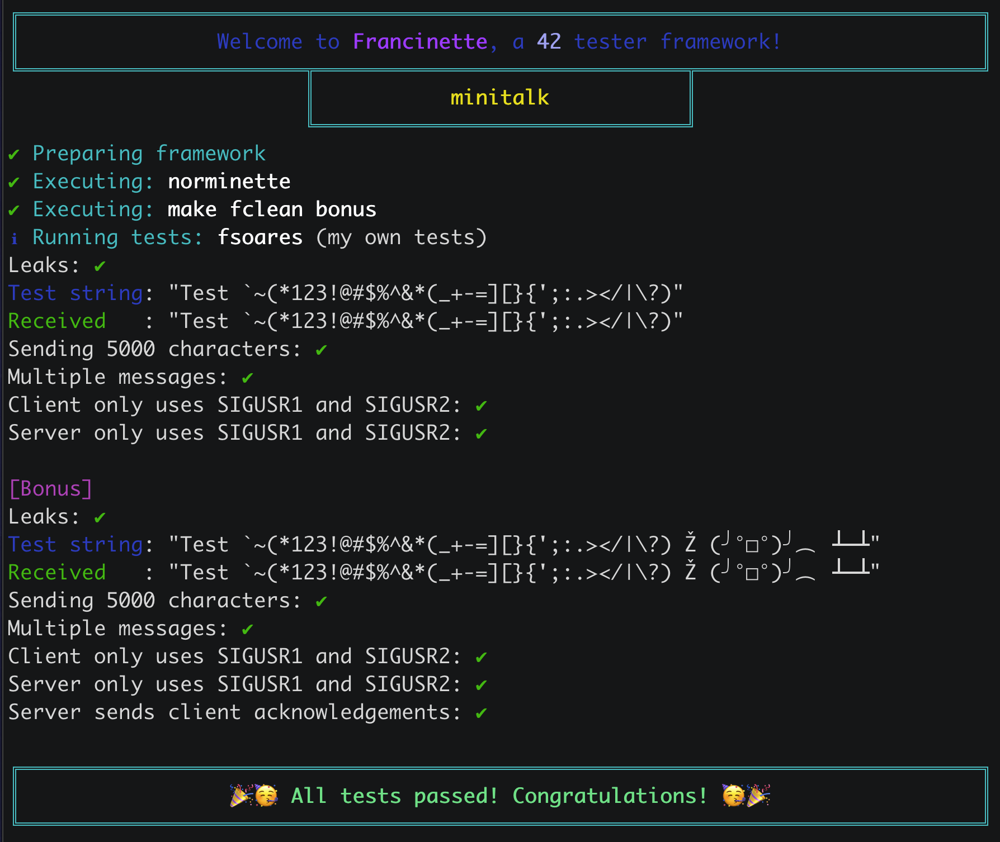
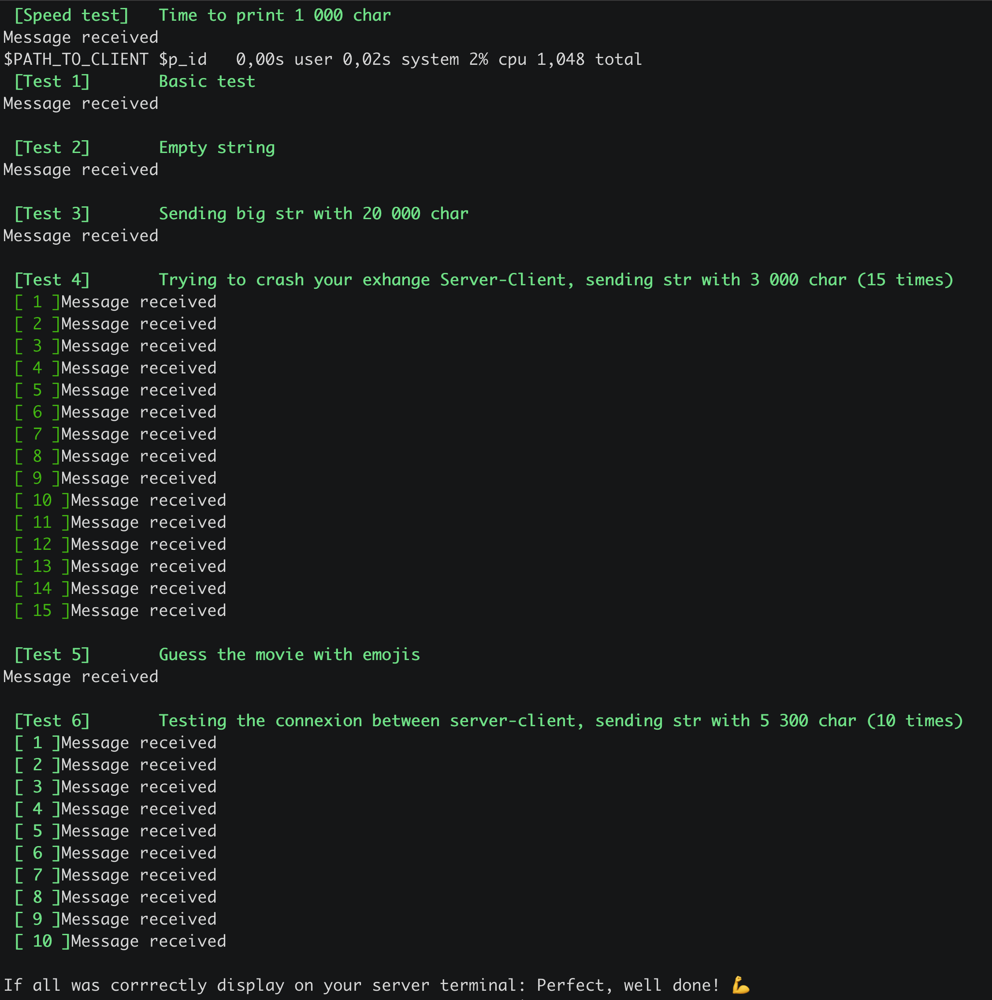

>Not the best way, but it works (bonus added)


## Index
1. [Objectif](#objectif)
2. [Sujet](#sujet)
    - [Fonctions autorisées](#fonctions-autorisées)
    - [Contraintes et règles](#contraintes-et-règles)
    - [Bonus](#bonus)
3. [Fonctionnement](#fonctionnement)
    - [client.c](#clientc)
    - [server.c](#serverc)
    - [ft_printf()](#ft_printf)
    - [Types de données utilisées](#types-de-données-utilisées)
4. [Fonctions mises à jour (pour bonus)](#fonctions-mises-à-jour)
    - [confirmation_handler](#void-confirmation_handlerint-sig)
    - [send_message](#void-send_messagepid_t-server_pid-const-char-str)
    - [main](#int-mainint-argc-char-argv)
5. [Résultats des tests](#résultats-des-tests)
6. [Note](#note)
7. [Liens utiles](#liens-utiles)

<br>

## OBJECTIF
Mettre en œuvre une communication simple et efficace entre deux programmes, un client et un serveur, utilisant les signaux UNIX. Le client envoie un message au serveur, qui le reçoit et l'affiche.

## SUJET
Réalisation d'un système de communication entre un client et un serveur à l'aide des signaux UNIX.
```
- Communication Client-Serveur : Le client doit être capable d'envoyer un message au serveur. Le serveur doit être capable de recevoir ce message et de l'afficher correctement.

- Encodage des Caractères : Le client doit convertir chaque caractère du message en une séquence de bits avant de l'envoyer au serveur. Cette conversion permet d'envoyer les informations bit par bit.
```

### Fonctions Autorisées
Les fonctions autorisées pour la réalisation de ce projet sont limitées aux fonctions système et bibliothèques standards suivantes :

- write
- ft_printf (voir [ici](https://github.com/aceyzz/42-ft_printf))
- signal
- sigemptyset
- sigaddset
- sigaction
- kill
- getpid
- malloc
- free
- pause
- sleep
- usleep
- exit

### Contraintes et Règles

- Utilisation des signaux UNIX : La communication entre le client et le serveur doit se faire uniquement à l'aide des signaux UNIX, en particulier les signaux SIGUSR1 et SIGUSR2.

- Affichage du message côté serveur : Le serveur doit être capable de recevoir le message du client et de l'afficher correctement.

- Envoi de bits côté client : Le client doit convertir chaque caractère du message en une séquence de bits, puis envoyer ces bits au serveur à l'aide des signaux SIGUSR1 et SIGUSR2.
<br>

### Bonus

- Le serveur doit confirmer la réception de chaque message en envoyant un signal au client. (Ajout aussi d'un message de confirmation côté client. Pas explicite, mais bon sens oblige ?).

- Le serveur doit supporter les caractères Unicode.
         


## Fonctionnement

	client.c

Fonction principale du client, qui prend deux arguments en ligne de commande : le PID du serveur et le message à envoyer. La fonction send_message convertit chaque caractère du message en une séquence de bits, puis envoie ces bits au serveur en utilisant les signaux SIGUSR1 et SIGUSR2. Le délai d'attente entre chaque bit est assuré par usleep(100).

	server.c

Fonction principale du serveur. Le serveur affiche le message reçu du client caractère par caractère. La fonction bit_received est appelée chaque fois qu'un signal SIGUSR1 ou SIGUSR2 est reçu, permettant ainsi au serveur de reconstruire le message à partir des bits reçus.

	minitalk.h
Déclarations des librairies (standards et personnelle) nécessaires des fonctions utilisées dans les fichiers client.c et server.c. La fonction bit_received est déclarée pour le serveur, et la fonction send_message est déclarée pour le client.


## Fonctions utilisés


### client.c
```
1. Fonction confirmation_handler(int sig):
2.    Si le signal reçu est SIGUSR1:
3.        Afficher le message "Message received".
4.        Terminer le programme avec exit(0).

5. Fonction send_message(pid_t server_pid, const char *str):
6.    Initialiser les variables locales i, bit, k.
7.    Tant que 1 (boucle infinie):
8.        Initialiser k à zéro.
9.        Tant que k est inférieur à 8:
10.           Extraire le k-ème bit du caractère str[i] et le stocker dans la variable bit.
11.           Si bit est égal à 1:
12.               Envoyer le signal SIGUSR1 au serveur.
13.           Sinon:
14.               Envoyer le signal SIGUSR2 au serveur.
15.           Attendre 100 microsecondes (usleep).
16.           Incrémenter k.
17.       Fin de la boucle intérieure.
18.       Si str[i] est nul:
19.           Terminer la boucle infinie (break).
20.       Incrémenter i.
21.   Fin de la boucle extérieure.
22. Fin de la fonction.

23. Fonction main(int argc, char *argv[]):
24.   Si argc n'est pas égal à 3:
25.       Afficher un message d'erreur indiquant le bon usage du programme.
26.       Retourner 1 (indiquant une erreur).
27.   Récupérer le PID du serveur à partir de argv[1].
28.   Configurer le gestionnaire de signal pour le SIGUSR1 en appelant confirmation_handler.
29.   Appeler la fonction send_message avec le PID du serveur et le message à envoyer.
30.   Initialiser la variable timeout à 5000000 (5 secondes).
31.   Tant que timeout est supérieur à 0:
32.       Mettre le programme en pause.
33.       Décrémenter timeout de 100 microsecondes.
34.   Fin de la boucle.
35.   Afficher le message "Timeout, message not confirmed".
36.   Retourner 0 (indiquant une exécution sans erreur).

```
<br>

---

### server.c
```
1. Fonction bit_received(int sig, siginfo_t *info, void *context):
2.    Initialiser les variables statiques bit et c.
3.    Si le signal reçu est SIGUSR1:
4.        Mettre à jour la variable c en utilisant le bit courant.
5.    Incrémenter le compteur bit.
6.    Si le compteur bit est égal à 8:
7.        Si le caractère reconstruit c est un caractère nul:
8.            Afficher un retour à la ligne.
9.            Envoyer le signal SIGUSR1 au processus émetteur (client) pour indiquer la réception du message.
10.       Sinon:
11.           Afficher le caractère reconstruit.
12.       Réinitialiser le compteur bit et la variable c à zéro.
13. Fin de la fonction.

14. Fonction main(void):
15.    Initialiser la structure sa pour la gestion des signaux.
16.    Afficher le PID du serveur.
17.    Configurer la gestion des signaux pour utiliser la fonction bit_received avec informations supplémentaires (SA_SIGINFO).
18.    Entrer dans une boucle infinie en utilisant pause() pour attendre les signaux.
19. Fin de la fonction.
```

<br>

---

### ```ft_printf()``` 
Afin d'afficher le message envoyé par le client. Codée lors du cercle précédent. (Lien [ici](https://github.com/aceyzz/42-Cursus/tree/main/1-ft_printf))

<br>

---

### Types de données utilisées

>```pid_t```

Type de données utilisé pour représenter les identifiants de processus (PID).<br>
Utilisé pour stocker et manipuler les identifiants de processus, par exemple, pour représenter le PID du serveur dans le programme client.c.

<br>

>```SIGUSR1``` et ```SIGUSR2```

Signaux utilisateur réservés dans le système d'exploitation Unix/Linux.
Ces signaux peuvent être utilisés par les programmes pour communiquer entre eux.<br>
Utilisés comme mécanisme de communication entre le client et le serveur dans les programmes client.c et server.c.
Le client envoie ces signaux au serveur pour transmettre des informations.

<br>

>```struct sigaction```

Structure utilisée pour spécifier une nouvelle action à associer à un signal particulier.<br>
Utilisée pour configurer la gestion des signaux dans le programme server.c. La fonction sigaction permet de lire ou de modifier l'action associée à un signal particulier en spécifiant cette structure.

<br>

---

### ```<signal.h>```

>```void (*signal(int signum, void (*handler)(int)))(int);```

Permet de définir le gestionnaire de signal pour le signal spécifié signum.
Le paramètre handler est un pointeur vers la fonction qui sera appelée lorsque le signal est reçu.
Retourne le gestionnaire de signal précédent ou SIG_ERR en cas d'erreur.<br>
**Utilisée dans server.c pour configurer la gestion des signaux avec la fonction bit_received dans la fonction main.**

<br>

>```int sigaction(int signum, const struct sigaction *act, struct sigaction *oldact)```;

Permet de lire ou de modifier l'action associée à un signal.
La structure struct sigaction spécifie le comportement souhaité pour le signal spécifié signum.
La structure struct sigaction peut inclure une fonction de gestion des signaux (sa_handler) ou une fonction de gestion des signaux avec informations supplémentaires (sa_sigaction).<br>
**Utilisée dans server.c pour configurer la gestion des signaux avec la fonction bit_received dans la fonction main.**

<br>

>```int kill(pid_t pid, int sig);```

Envoie le signal sig au processus spécifié par pid.
**Utilisé pour envoyer les signaux SIGUSR1 et SIGUSR2 du client vers le serveur dans client.c.**

<br>

>```int usleep(useconds_t usec);```

Suspend l'exécution du programme pendant le nombre de microsecondes spécifié.<br>
**Utilisée dans client.c pour introduire un délai d'attente entre l'envoi de chaque bit.**

---

### Fonctions mises à jour

>```void confirmation_handler(int sig)```

Fonction de gestion du signal qui est appelée lorsqu'un signal SIGUSR1 est reçu dans le client.<br>
Si le signal est SIGUSR1, affiche le message "Message received" et termine le programme.

<br>

>```void send_message(pid_t server_pid, const char *str)```

Fonction permettant d'envoyer un message au serveur à l'aide des signaux SIGUSR1 et SIGUSR2.<br>
Pour chaque bit du message, envoie le signal correspondant au serveur (SIGUSR1 pour 1, SIGUSR2 pour 0).<br>
Introduit un délai d'attente de 100 microsecondes entre chaque envoi de signal.<br>
Après l'envoi complet du message, attend la confirmation du serveur en utilisant un tube.

<br>

>```int main(int argc, char *argv[])```

Fonction principale du client.
Si le nombre d'arguments n'est pas égal à 3, affiche un message d'erreur indiquant le bon usage du programme et retourne 1.<br>
Récupère le PID du serveur à partir des arguments.<br>
Configure le gestionnaire de signal pour le signal SIGUSR1 avec confirmation_handler.<br>
Appelle la fonction send_message avec le PID du serveur et le message à envoyer.<br>
Introduit un timeout de 5 secondes en utilisant la fonction pause.<br>
Affiche un message de timeout si la confirmation du serveur n'est pas reçue.<br>
Retourne 0 à la fin de l'exécution.<br>

<br>

---

<br>


## Résultats des tests

| Test de [Francinette](https://github.com/xicodomingues/francinette) thanks to [Francisco](https://github.com/xicodomingues) | |
| --------------- | ------------- |



| Test de [Minitalk Tester](https://github.com/ThibaudM13/minitalk-Tester) thanks to [Thibo_M](https://github.com/ThibaudM13) | |
| --------------- | ------------- |

 
## Note

(En cours d'évaluation...)

<br>

---

<br>

## Liens utiles

[Understand Minitalk](https://42-cursus.gitbook.io/guide/rank-02/minitalk/understand-minitalk) Thanks to [Laura](https://github.com/TheBrisly) and [Simon](https://github.com/Laendrun)


<br>
<br>
<br>
<br>

## DON'T COPY. LEARN.
*and RTFM*
