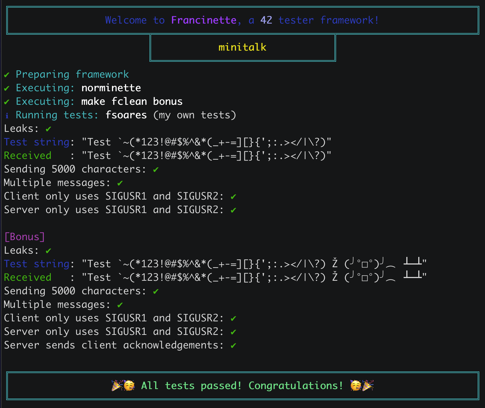
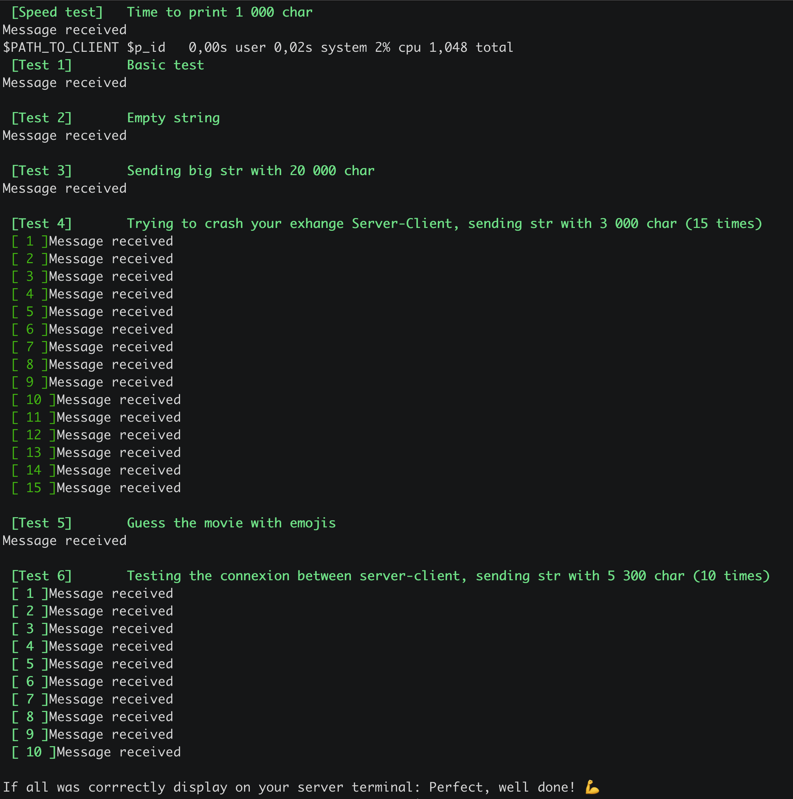

<br>

---

<br>

<details>
<summary>FRENCH VERSION</summary>

## Index

1. [Objectif](#objectif)
2. [Sujet](#sujet)
    - [Fonctions autorisées](#fonctions-autorisées)
    - [Contraintes et règles](#contraintes-et-règles)
    - [Bonus](#bonus)
3. [Fonctionnement](#fonctionnement)
    - [client.c](#clientc)
    - [server.c](#serverc)
    - [ft_printf()](#ft_printf)
    - [Types de données utilisées](#types-de-données-utilisées)
4. [Fonctions mises à jour (pour bonus)](#fonctions-mises-à-jour)
    - [confirmation_handler](#void-confirmation_handlerint-sig)
    - [send_message](#void-send_messagepid_t-server_pid-const-char-str)
    - [main](#int-mainint-argc-char-argv)
5. [Résultats des tests](#résultats-des-tests)
6. [Note](#note)
7. [Liens utiles](#liens-utiles)

<br>

## OBJECTIF
Mettre en œuvre une communication simple et efficace entre deux programmes, un client et un serveur, utilisant les signaux UNIX. Le client envoie un message au serveur, qui le reçoit et l'affiche.

## SUJET
Réalisation d'un système de communication entre un client et un serveur à l'aide des signaux UNIX.
```
- Communication Client-Serveur : Le client doit être capable d'envoyer un message au serveur. Le serveur doit être capable de recevoir ce message et de l'afficher correctement.

- Encodage des Caractères : Le client doit convertir chaque caractère du message en une séquence de bits avant de l'envoyer au serveur. Cette conversion permet d'envoyer les informations bit par bit.
```

### Fonctions Autorisées
Les fonctions autorisées pour la réalisation de ce projet sont limitées aux fonctions système et bibliothèques standards suivantes :

- write
- ft_printf (voir [ici](https://github.com/aceyzz/42-ft_printf))
- signal
- sigemptyset
- sigaddset
- sigaction
- kill
- getpid
- malloc
- free
- pause
- sleep
- usleep
- exit

### Contraintes et Règles

- Utilisation des signaux UNIX : La communication entre le client et le serveur doit se faire uniquement à l'aide des signaux UNIX, en particulier les signaux SIGUSR1 et SIGUSR2.

- Affichage du message côté serveur : Le serveur doit être capable de recevoir le message du client et de l'afficher correctement.

- Envoi de bits côté client : Le client doit convertir chaque caractère du message en une séquence de bits, puis envoyer ces bits au serveur à l'aide des signaux SIGUSR1 et SIGUSR2.
<br>

### Bonus

- Le serveur doit confirmer la réception de chaque message en envoyant un signal au client. (Ajout aussi d'un message de confirmation côté client. Pas explicite, mais bon sens oblige ?).

- Le serveur doit supporter les caractères Unicode.
         
## Arborescence du projet
```
├── Makefile				# Compilation automatisée.
├── inc
│   └── minitalk.h			# Déclarations des fonctions et bibliothèques.
├── src
│   ├── client.c			# Programme client.
│   └── server.c			# Programme serveur.
└── utils
	└── ft_printf
		├── ft_atoi.c		# Conversion chaîne → entier.
		├── ft_printf.c		# Formatage de chaînes.
		├── ft_printf.h		# En-tête ft_printf.
		├── print_first.c	# Conversions spécifiques.
		└── print_second.c	# Autres conversions.
```
<br>


## Fonctionnement

	client.c

Fonction principale du client, qui prend deux arguments en ligne de commande : le PID du serveur et le message à envoyer. La fonction send_message convertit chaque caractère du message en une séquence de bits, puis envoie ces bits au serveur en utilisant les signaux SIGUSR1 et SIGUSR2. Le délai d'attente entre chaque bit est assuré par usleep(100).

	server.c

Fonction principale du serveur. Le serveur affiche le message reçu du client caractère par caractère. La fonction bit_received est appelée chaque fois qu'un signal SIGUSR1 ou SIGUSR2 est reçu, permettant ainsi au serveur de reconstruire le message à partir des bits reçus.

	minitalk.h
Déclarations des librairies (standards et personnelle) nécessaires des fonctions utilisées dans les fichiers client.c et server.c. La fonction bit_received est déclarée pour le serveur, et la fonction send_message est déclarée pour le client.


## Fonctions utilisés


### client.c
```
1. Fonction confirmation_handler(int sig):
2.    Si le signal reçu est SIGUSR1:
3.        Afficher le message "Message received".
4.        Terminer le programme avec exit(0).

5. Fonction send_message(pid_t server_pid, const char *str):
6.    Initialiser les variables locales i, bit, k.
7.    Tant que 1 (boucle infinie):
8.        Initialiser k à zéro.
9.        Tant que k est inférieur à 8:
10.           Extraire le k-ème bit du caractère str[i] et le stocker dans la variable bit.
11.           Si bit est égal à 1:
12.               Envoyer le signal SIGUSR1 au serveur.
13.           Sinon:
14.               Envoyer le signal SIGUSR2 au serveur.
15.           Attendre 100 microsecondes (usleep).
16.           Incrémenter k.
17.       Fin de la boucle intérieure.
18.       Si str[i] est nul:
19.           Terminer la boucle infinie (break).
20.       Incrémenter i.
21.   Fin de la boucle extérieure.
22. Fin de la fonction.

23. Fonction main(int argc, char *argv[]):
24.   Si argc n'est pas égal à 3:
25.       Afficher un message d'erreur indiquant le bon usage du programme.
26.       Retourner 1 (indiquant une erreur).
27.   Récupérer le PID du serveur à partir de argv[1].
28.   Configurer le gestionnaire de signal pour le SIGUSR1 en appelant confirmation_handler.
29.   Appeler la fonction send_message avec le PID du serveur et le message à envoyer.
30.   Initialiser la variable timeout à 5000000 (5 secondes).
31.   Tant que timeout est supérieur à 0:
32.       Mettre le programme en pause.
33.       Décrémenter timeout de 100 microsecondes.
34.   Fin de la boucle.
35.   Afficher le message "Timeout, message not confirmed".
36.   Retourner 0 (indiquant une exécution sans erreur).

```
<br>

---

### server.c
```
1. Fonction bit_received(int sig, siginfo_t *info, void *context):
2.    Initialiser les variables statiques bit et c.
3.    Si le signal reçu est SIGUSR1:
4.        Mettre à jour la variable c en utilisant le bit courant.
5.    Incrémenter le compteur bit.
6.    Si le compteur bit est égal à 8:
7.        Si le caractère reconstruit c est un caractère nul:
8.            Afficher un retour à la ligne.
9.            Envoyer le signal SIGUSR1 au processus émetteur (client) pour indiquer la réception du message.
10.       Sinon:
11.           Afficher le caractère reconstruit.
12.       Réinitialiser le compteur bit et la variable c à zéro.
13. Fin de la fonction.

14. Fonction main(void):
15.    Initialiser la structure sa pour la gestion des signaux.
16.    Afficher le PID du serveur.
17.    Configurer la gestion des signaux pour utiliser la fonction bit_received avec informations supplémentaires (SA_SIGINFO).
18.    Entrer dans une boucle infinie en utilisant pause() pour attendre les signaux.
19. Fin de la fonction.
```

<br>

---

### ```ft_printf()``` 
Afin d'afficher le message envoyé par le client. Codée lors du cercle précédent. (Lien [ici](https://github.com/aceyzz/42-Cursus/tree/main/1-ft_printf))

<br>

---

### Types de données utilisées

>```pid_t```

Type de données utilisé pour représenter les identifiants de processus (PID).<br>
Utilisé pour stocker et manipuler les identifiants de processus, par exemple, pour représenter le PID du serveur dans le programme client.c.

<br>

>```SIGUSR1``` et ```SIGUSR2```

Signaux utilisateur réservés dans le système d'exploitation Unix/Linux.
Ces signaux peuvent être utilisés par les programmes pour communiquer entre eux.<br>
Utilisés comme mécanisme de communication entre le client et le serveur dans les programmes client.c et server.c.
Le client envoie ces signaux au serveur pour transmettre des informations.

<br>

>```struct sigaction```

Structure utilisée pour spécifier une nouvelle action à associer à un signal particulier.<br>
Utilisée pour configurer la gestion des signaux dans le programme server.c. La fonction sigaction permet de lire ou de modifier l'action associée à un signal particulier en spécifiant cette structure.

<br>

---

### ```<signal.h>```

>```void (*signal(int signum, void (*handler)(int)))(int);```

Permet de définir le gestionnaire de signal pour le signal spécifié signum.
Le paramètre handler est un pointeur vers la fonction qui sera appelée lorsque le signal est reçu.
Retourne le gestionnaire de signal précédent ou SIG_ERR en cas d'erreur.<br>
**Utilisée dans server.c pour configurer la gestion des signaux avec la fonction bit_received dans la fonction main.**

<br>

>```int sigaction(int signum, const struct sigaction *act, struct sigaction *oldact)```;

Permet de lire ou de modifier l'action associée à un signal.
La structure struct sigaction spécifie le comportement souhaité pour le signal spécifié signum.
La structure struct sigaction peut inclure une fonction de gestion des signaux (sa_handler) ou une fonction de gestion des signaux avec informations supplémentaires (sa_sigaction).<br>
**Utilisée dans server.c pour configurer la gestion des signaux avec la fonction bit_received dans la fonction main.**

<br>

>```int kill(pid_t pid, int sig);```

Envoie le signal sig au processus spécifié par pid.
**Utilisé pour envoyer les signaux SIGUSR1 et SIGUSR2 du client vers le serveur dans client.c.**

<br>

>```int usleep(useconds_t usec);```

Suspend l'exécution du programme pendant le nombre de microsecondes spécifié.<br>
**Utilisée dans client.c pour introduire un délai d'attente entre l'envoi de chaque bit.**

---

### Fonctions mises à jour

>```void confirmation_handler(int sig)```

Fonction de gestion du signal qui est appelée lorsqu'un signal SIGUSR1 est reçu dans le client.<br>
Si le signal est SIGUSR1, affiche le message "Message received" et termine le programme.

<br>

>```void send_message(pid_t server_pid, const char *str)```

Fonction permettant d'envoyer un message au serveur à l'aide des signaux SIGUSR1 et SIGUSR2.<br>
Pour chaque bit du message, envoie le signal correspondant au serveur (SIGUSR1 pour 1, SIGUSR2 pour 0).<br>
Introduit un délai d'attente de 100 microsecondes entre chaque envoi de signal.<br>
Après l'envoi complet du message, attend la confirmation du serveur en utilisant un tube.

<br>

>```int main(int argc, char *argv[])```

Fonction principale du client.
Si le nombre d'arguments n'est pas égal à 3, affiche un message d'erreur indiquant le bon usage du programme et retourne 1.<br>
Récupère le PID du serveur à partir des arguments.<br>
Configure le gestionnaire de signal pour le signal SIGUSR1 avec confirmation_handler.<br>
Appelle la fonction send_message avec le PID du serveur et le message à envoyer.<br>
Introduit un timeout de 5 secondes en utilisant la fonction pause.<br>
Affiche un message de timeout si la confirmation du serveur n'est pas reçue.<br>
Retourne 0 à la fin de l'exécution.<br>

<br>

---

<br>


## Résultats des tests

| Test de [Francinette](https://github.com/xicodomingues/francinette) thanks to [Francisco](https://github.com/xicodomingues) | |
| --------------- | ------------- |



| Test de [Minitalk Tester](https://github.com/ThibaudM13/minitalk-Tester) thanks to [Thibo_M](https://github.com/ThibaudM13) | |
| --------------- | ------------- |

 
## Note


<br>

---

<br>

## Liens utiles

[Understand Minitalk](https://42-cursus.gitbook.io/guide/rank-02/minitalk/understand-minitalk) Thanks to [Laura](https://github.com/TheBrisly) and [Simon](https://github.com/Laendrun)


<br>
<br>
<br>
<br>

## Licence
This work is published under the terms of **[42 Unlicense](./LICENSE)**.

## DON'T COPY. LEARN.
*and RTFM*

<br>

</details>

<br>

---

<br>

<details>
<summary>ENGLISH VERSION</summary>

## Index

1. [Objective](#objective)
2. [Subject](#subject)
	- [Allowed Functions](#allowed-functions)
	- [Constraints and Rules](#constraints-and-rules)
	- [Bonus](#bonus)
3. [Functionality](#functionality)
	- [client.c](#clientc)
	- [server.c](#serverc)
	- [ft_printf()](#ft_printf)
	- [Data Types Used](#data-types-used)
4. [Updated Functions (for bonus)](#updated-functions-for-bonus)
	- [confirmation_handler](#void-confirmation_handlerint-sig)
	- [send_message](#void-send_messagepid_t-server_pid-const-char-str)
	- [main](#int-mainint-argc-char-argv)
5. [Test Results](#test-results)
6. [Grade](#grade)
7. [Useful Links](#useful-links)

<br>

## OBJECTIVE
Implement simple and efficient communication between two programs, a client and a server, using UNIX signals. The client sends a message to the server, which receives and displays it.

## SUBJECT
Development of a communication system between a client and a server using UNIX signals.
```
- Client-Server Communication: The client must be able to send a message to the server. The server must be able to receive this message and display it correctly.

- Character Encoding: The client must convert each character of the message into a sequence of bits before sending it to the server. This conversion allows sending information bit by bit.
```

### Allowed Functions
The functions allowed for this project are limited to the following system and standard library functions:

- write
- ft_printf (see [here](https://github.com/aceyzz/42-ft_printf))
- signal
- sigemptyset
- sigaddset
- sigaction
- kill
- getpid
- malloc
- free
- pause
- sleep
- usleep
- exit

### Constraints and Rules

- Use of UNIX Signals: Communication between the client and the server must be done exclusively using UNIX signals, particularly SIGUSR1 and SIGUSR2.

- Message Display on the Server Side: The server must be able to receive the client's message and display it correctly.

- Bit Transmission on the Client Side: The client must convert each character of the message into a sequence of bits, then send these bits to the server using SIGUSR1 and SIGUSR2.
<br>

### Bonus

- The server must confirm the reception of each message by sending a signal back to the client. (Also adding a confirmation message on the client side. Not explicit, but common sense?).

- The server must support Unicode characters.
		 
## Project Structure
```
├── Makefile				# Automated compilation.
├── inc
│   └── minitalk.h			# Function and library declarations.
├── src
│   ├── client.c			# Client program.
│   └── server.c			# Server program.
└── utils
	└── ft_printf
		├── ft_atoi.c		# String → integer conversion.
		├── ft_printf.c		# String formatting.
		├── ft_printf.h		# ft_printf header.
		├── print_first.c	# Specific conversions.
		└── print_second.c	# Other conversions.
```
<br>


## Functionality

	client.c

Main function of the client, which takes two command-line arguments: the server's PID and the message to send. The send_message function converts each character of the message into a sequence of bits, then sends these bits to the server using SIGUSR1 and SIGUSR2. The delay between each bit is ensured by usleep(100).

	server.c

Main function of the server. The server displays the message received from the client character by character. The bit_received function is called each time a SIGUSR1 or SIGUSR2 signal is received, allowing the server to reconstruct the message from the received bits.

	minitalk.h
Declarations of the necessary libraries (standard and custom) and functions used in client.c and server.c. The bit_received function is declared for the server, and the send_message function is declared for the client.


## Functions Used


### client.c
```
1. Function confirmation_handler(int sig):
2.    If the received signal is SIGUSR1:
3.        Display the message "Message received".
4.        Terminate the program with exit(0).

5. Function send_message(pid_t server_pid, const char *str):
6.    Initialize local variables i, bit, k.
7.    While 1 (infinite loop):
8.        Initialize k to zero.
9.        While k is less than 8:
10.           Extract the k-th bit of the character str[i] and store it in the bit variable.
11.           If bit equals 1:
12.               Send the SIGUSR1 signal to the server.
13.           Else:
14.               Send the SIGUSR2 signal to the server.
15.           Wait 100 microseconds (usleep).
16.           Increment k.
17.       End of inner loop.
18.       If str[i] is null:
19.           Break the infinite loop.
20.       Increment i.
21.   End of outer loop.
22. End of function.

23. Function main(int argc, char *argv[]):
24.   If argc is not equal to 3:
25.       Display an error message indicating the correct usage of the program.
26.       Return 1 (indicating an error).
27.   Retrieve the server's PID from argv[1].
28.   Set up the signal handler for SIGUSR1 by calling confirmation_handler.
29.   Call the send_message function with the server's PID and the message to send.
30.   Initialize the timeout variable to 5000000 (5 seconds).
31.   While timeout is greater than 0:
32.       Pause the program.
33.       Decrement timeout by 100 microseconds.
34.   End of loop.
35.   Display the message "Timeout, message not confirmed".
36.   Return 0 (indicating successful execution).

```
<br>

---

### server.c
```
1. Function bit_received(int sig, siginfo_t *info, void *context):
2.    Initialize static variables bit and c.
3.    If the received signal is SIGUSR1:
4.        Update the variable c using the current bit.
5.    Increment the bit counter.
6.    If the bit counter equals 8:
7.        If the reconstructed character c is null:
8.            Display a newline.
9.            Send the SIGUSR1 signal to the sending process (client) to indicate message reception.
10.       Else:
11.           Display the reconstructed character.
12.       Reset the bit counter and variable c to zero.
13. End of function.

14. Function main(void):
15.    Initialize the sa structure for signal handling.
16.    Display the server's PID.
17.    Set up signal handling to use the bit_received function with additional information (SA_SIGINFO).
18.    Enter an infinite loop using pause() to wait for signals.
19. End of function.
```

<br>

---

### ```ft_printf()``` 
Used to display the message sent by the client. Implemented in the previous circle. (Link [here](https://github.com/aceyzz/42-Cursus/tree/main/1-ft_printf))

<br>

---

### Data Types Used

>```pid_t```

Data type used to represent process identifiers (PIDs).<br>
Used to store and manipulate process identifiers, for example, to represent the server's PID in the client.c program.

<br>

>```SIGUSR1``` and ```SIGUSR2```

User-defined signals in the Unix/Linux operating system.
These signals can be used by programs to communicate with each other.<br>
Used as a communication mechanism between the client and the server in client.c and server.c.
The client sends these signals to the server to transmit information.

<br>

>```struct sigaction```

Structure used to specify a new action to associate with a particular signal.<br>
Used to configure signal handling in the server.c program. The sigaction function allows reading or modifying the action associated with a particular signal by specifying this structure.

<br>

---

### ```<signal.h>```

>```void (*signal(int signum, void (*handler)(int)))(int);```

Allows defining the signal handler for the specified signal signum.
The handler parameter is a pointer to the function that will be called when the signal is received.
Returns the previous signal handler or SIG_ERR in case of an error.<br>
**Used in server.c to configure signal handling with the bit_received function in the main function.**

<br>

>```int sigaction(int signum, const struct sigaction *act, struct sigaction *oldact)```;

Allows reading or modifying the action associated with a signal.
The struct sigaction structure specifies the desired behavior for the specified signal signum.
The struct sigaction structure can include a signal handling function (sa_handler) or a signal handling function with additional information (sa_sigaction).<br>
**Used in server.c to configure signal handling with the bit_received function in the main function.**

<br>

>```int kill(pid_t pid, int sig);```

Sends the sig signal to the process specified by pid.
**Used to send SIGUSR1 and SIGUSR2 signals from the client to the server in client.c.**

<br>

>```int usleep(useconds_t usec);```

Suspends program execution for the specified number of microseconds.<br>
**Used in client.c to introduce a delay between sending each bit.**

---

### Updated Functions

>```void confirmation_handler(int sig)```

Signal handling function called when a SIGUSR1 signal is received in the client.<br>
If the signal is SIGUSR1, displays the message "Message received" and terminates the program.

<br>

>```void send_message(pid_t server_pid, const char *str)```

Function to send a message to the server using SIGUSR1 and SIGUSR2 signals.<br>
For each bit of the message, sends the corresponding signal to the server (SIGUSR1 for 1, SIGUSR2 for 0).<br>
Introduces a delay of 100 microseconds between each signal.<br>
After sending the complete message, waits for the server's confirmation using a pipe.

<br>

>```int main(int argc, char *argv[])```

Main function of the client.
If the number of arguments is not equal to 3, displays an error message indicating the correct usage of the program and returns 1.<br>
Retrieves the server's PID from the arguments.<br>
Sets up the signal handler for SIGUSR1 with confirmation_handler.<br>
Calls the send_message function with the server's PID and the message to send.<br>
Introduces a 5-second timeout using the pause function.<br>
Displays a timeout message if the server's confirmation is not received.<br>
Returns 0 at the end of execution.<br>

<br>

---

<br>


## Test Results

| Test from [Francinette](https://github.com/xicodomingues/francinette) thanks to [Francisco](https://github.com/xicodomingues) | |
| --------------- | ------------- |


| Test from [Minitalk Tester](https://github.com/ThibaudM13/minitalk-Tester) thanks to [Thibo_M](https://github.com/ThibaudM13) | |
| --------------- | ------------- |

 
## Grade


<br>

---

<br>

## Useful Links

[Understand Minitalk](https://42-cursus.gitbook.io/guide/rank-02/minitalk/understand-minitalk) Thanks to [Laura](https://github.com/TheBrisly) and [Simon](https://github.com/Laendrun)


<br>
<br>
<br>
<br>

## License
This work is published under the terms of **[42 Unlicense](./LICENSE)**.

## DON'T COPY. LEARN.
*and RTFM*

<br>

</details>